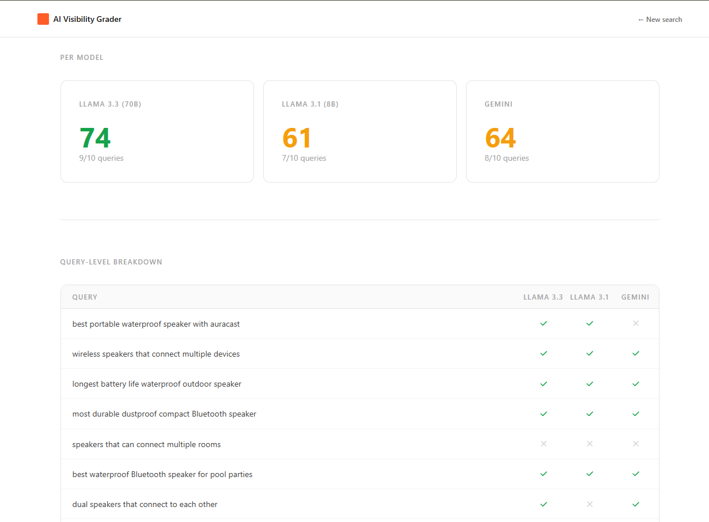

# AI Visibility Grader

**Is your Amazon product invisible to AI shoppers?**

Type your brand and product name. Get a 0-100 score showing how often Llama, Gemini, and other AI models recommend your brand when real shoppers ask buying questions -- plus 5 specific listing fixes. No ASIN, no account, no friction.

---

## Try it live

**[ai-visibility-grader.vercel.app](https://ai-visibility-grader.vercel.app)**

> First request may take 10-15 s while the Render backend wakes from sleep.

---



---

## Why this matters

Research suggests 20-30% of online shoppers now ask an AI assistant before visiting Amazon. If your brand does not appear in those responses, you are invisible before the shopping journey begins. Traditional listing optimisation (keywords, images, reviews) does not automatically translate into AI recommendation signals. This tool makes the gap measurable.

---

## What you get

- **AI Visibility Score (0-100)** -- how often all three AI models recommend your brand across 10 buyer queries
- **Per-model breakdown** -- separate scores for Llama 3.3 70B, Llama 3.1 8B, and Gemini
- **Query-level table** -- which queries you won, which you lost, and at what position
- **Top competitors** -- the 5 brands beating you most, ranked by mention frequency
- **5 specific recommendations** -- grounded in the exact queries you lost and the attributes your competitors have that you do not

---

## Architecture

```
+----------------------------------------------------------+
|  Frontend (Next.js 14, Vercel)                           |
|  { brand, title } -> POST /diagnose -> DiagnoseResponse  |
+-------------------------+--------------------------------+
                          |
+-------------------------v--------------------------------+
|  Backend (FastAPI, Render)                               |
|                                                          |
|  1. ProductFetcher    brand+title -> real Amazon listing  |
|                       (search scrape -> ASIN -> scrape)  |
|  2. QueryGenerator    Product -> 10 generic buyer queries |
|                       (no brand/model names in queries)  |
|  3. LLMRunner         10 queries x 3 models = 30 calls   |
|                       (asyncio.gather, fully parallel)    |
|  4. ResponseParser    30 responses -> structured JSON     |
|                       (batched: 10 LLM calls total)      |
|  5. Scorer            Weighted position scoring -> 0-100  |
|                       (brand filtered from competitors)  |
|  6. Recommender       Diagnostic data -> 5 fixes          |
|                       (Gemini first, Groq fallback)      |
+----------------------------------------------------------+
```

---

## Engineering decisions

**No ASIN input -- brand and product name instead.**
ASINs create friction and require a separate lookup step that frequently fails on cloud IPs. Taking brand and product name directly lets the backend search for the real Amazon listing (scraping the search results page for an ASIN, then scraping the product page), or fall back to a stub product that is still sufficient to generate accurate buyer queries. Zero user friction, same data quality.

**Why Groq + OpenRouter instead of OpenAI?**
Groq serves Llama 3.3 70B with sub-second token generation on free-tier credits. OpenRouter acts as a fallback when Groq is rate-limited. A circuit breaker (`llm_clients/_health.py`) tracks per-model failure timestamps with a 35-second cooldown, so a single rate-limit event does not cascade into a failed request.

**Why batch the parser to 10 calls instead of 30?**
The original design made one LLM call per model response (30 total). Batching all three responses into one parsing call per query cuts the parsing phase from 30 calls to 10, saving ~20 seconds with no accuracy loss.

**Why Gemini first for recommendations?**
The 30 scoring calls and 10 parse calls burn through Groq quota. By the time recommendations run, Groq is often rate-limited and requires retries. Routing the single recommendations call to Gemini (which has untouched quota) cuts that step from 15-25 seconds to 3-5 seconds.

**Why asyncio.gather for the 30 LLM calls?**
All 30 query-by-model combinations are independent. Running them in parallel means the scoring phase is bounded by the slowest single call (~8 s) rather than the sum (~5 min sequential). A semaphore (`asyncio.Semaphore(4)`) on GenerationClient prevents TPM bursts during the parse phase.

**Why position-weighted scoring?**
Ranking 1st in an AI response is meaningfully better than ranking 5th. Weights: 1st=1.0, 2nd=0.7, 3rd=0.5, 4th+=0.3, mentioned without rank=0.25. The 0.25 weight handles prose responses where position is ambiguous rather than penalising them as zero.

**Why filter brand names out of queries?**
Queries that include the product name (e.g. "Galaxy S25 vs iPhone 14") test brand recognition, not AI visibility. The query generator is instructed to produce generic buyer-intent queries, and a post-generation filter (`_is_branded`) strips any that slip through using brand token matching and model-number detection with unit-suffix exclusions (50mp, 12gb, etc. pass through; S25, A54 do not).

---

## Cost and latency

All providers used are free tier.

| Phase | Provider | Calls | Typical latency |
|---|---|---|---|
| Product search | Amazon scrape | 1-2 | 2-5 s |
| Query generation | Groq (Llama 3.3 70B) | 1 | ~2 s |
| LLM scoring | Groq + Gemini | 30 parallel | ~8-10 s |
| Response parsing | Groq (Llama 3.3 70B) | 10 parallel | ~20-30 s |
| Recommendations | Gemini Flash | 1 | ~4 s |
| **Total** | | **42+ calls** | **~60-100 s** |

End-to-end cost per run is effectively $0 on free tiers.

---

## Setup

### Prerequisites

- Python 3.11+
- Node.js 18+
- Groq API key (free at console.groq.com)
- Google Gemini API key (free at aistudio.google.com)

### Backend

```bash
cd backend
python -m venv .venv && source .venv/bin/activate   # Windows: .venv\Scripts\activate
pip install -r requirements.txt
cp .env.example .env          # fill in GROQ_API_KEY and GOOGLE_API_KEY
uvicorn main:app --reload --port 8000
```

### Frontend

```bash
cd frontend
npm install
cp .env.local.example .env.local
npm run dev
```

Open `http://localhost:3000`.

---

## Environment variables

### Backend (`backend/.env`)

| Variable | Required | Description |
|---|---|---|
| `GROQ_API_KEY` | Yes | Llama 3.3 70B and 3.1 8B -- query gen, parsing |
| `GOOGLE_API_KEY` | Yes | Gemini 1.5 Flash -- scoring + recommendations |
| `OPENROUTER_API_KEY` | No | Fallback when Groq is rate-limited |
| `RAINFOREST_API_KEY` | No | Reliable product lookup on cloud deployments |

### Frontend (`frontend/.env.local`)

| Variable | Default | Description |
|---|---|---|
| `NEXT_PUBLIC_API_URL` | `http://localhost:8000` | Backend URL |

---

## Deployment

### Backend (Render free tier)

1. Push repo to GitHub
2. New Web Service on Render, root: `backend/`
3. Build: `pip install -r requirements.txt`
4. Start: `uvicorn main:app --host 0.0.0.0 --port $PORT`
5. Add `GROQ_API_KEY` and `GOOGLE_API_KEY` in environment variables

### Frontend (Vercel)

1. Import repo into Vercel, root directory: `frontend/`
2. Add `NEXT_PUBLIC_API_URL` pointing to your Render URL
3. Deploy

---

## Scoring

```
Per model score:
  sum(position_weight) / total_queries x 100

Weights: 1st=1.0  2nd=0.7  3rd=0.5  4th+=0.3  mention(no rank)=0.25  not mentioned=0.0

Overall = average(llama70b, llama8b, gemini)
```

---

## Repo structure

```
ai-visibility-grader/
+-- backend/
|   +-- main.py                  # FastAPI app, /diagnose endpoint
|   +-- models.py                # Pydantic schemas
|   +-- services/
|   |   +-- product_fetcher.py   # brand+title -> real Amazon listing
|   |   +-- query_generator.py   # Product -> 10 generic buyer queries
|   |   +-- llm_runner.py        # 30 parallel LLM scoring calls
|   |   +-- parser.py            # Batched LLM extraction (10 calls)
|   |   +-- scorer.py            # Weighted position scoring
|   |   +-- recommender.py       # 5 improvement recommendations (Gemini-first)
|   +-- llm_clients/
|   |   +-- _health.py           # Circuit breaker (35s cooldown per model)
|   |   +-- groq_client.py       # Llama 3.3 70B + 3.1 8B
|   |   +-- openrouter_client.py # Fallback free models
|   |   +-- gemini_client.py     # Gemini 1.5 Flash
|   |   +-- generation_client.py # Health-aware provider router
|   +-- requirements.txt
|   +-- .env.example
+-- frontend/
|   +-- app/
|   |   +-- page.tsx             # Landing page + report view
|   +-- components/
|   |   +-- ScoreHero.tsx
|   |   +-- ModelCard.tsx
|   |   +-- QueryTable.tsx
|   |   +-- CompetitorList.tsx
|   |   +-- RecommendationCard.tsx
|   |   +-- LoadingScreen.tsx
|   +-- lib/api.ts               # Backend API client
|   +-- .env.local.example
+-- docs/
|   +-- hero.png
+-- LICENSE
+-- README.md
```

---

## Roadmap

- **SSE progress stream** -- real pipeline state in the loading screen instead of estimated timings
- **Persistent reports** -- Postgres + shareable URL per diagnostic run
- **Scheduled re-runs** -- weekly re-score with email delta to track visibility over time
- **Comparison mode** -- two brands side-by-side with diff highlighting
- **Multi-language** -- swap the query generator prompt; the rest of the pipeline is language-agnostic

---

## License

MIT. See [LICENSE](LICENSE).
